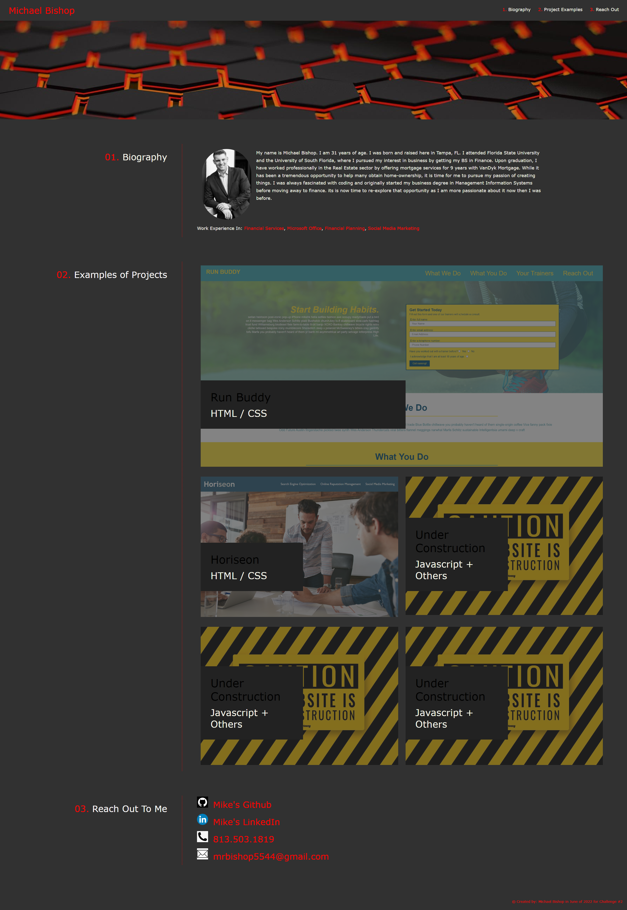
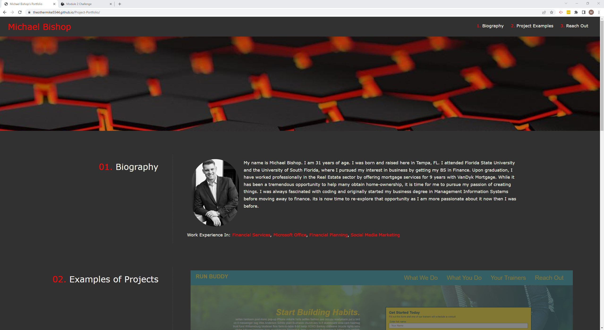

## Mike Bishop's Portfolio of BootCamp Work
This project was about the development of a webpage to showcase my projects throughout this bootcamp. It aims to further aid me in the later stages following the completion of this bootcamp as i seek employment and handle my interviews. I want this project to illustrate what I have accomplished in a clear and concise manner. I utilized this assignment to better represent the future work that I will be accomplishing throughout this course and will update the page accordingly as more projects are completed.

### Screenshot of Mike's Portfolio

### LIVE URL Screenshot of Mike's Portfolio

### Portfolio Link
Link to find Mike's Portfolio: https://theothermike5544.github.io/Project-Portfolio/
 
Link to find Mike's Run-Buddy: https://theothermike5544.github.io/run-buddy/
 
Link to find Mike's Horiseon-A-Better-Brand: https://theothermike5544.github.io/Horiseon-A-Better-Brand/ 
